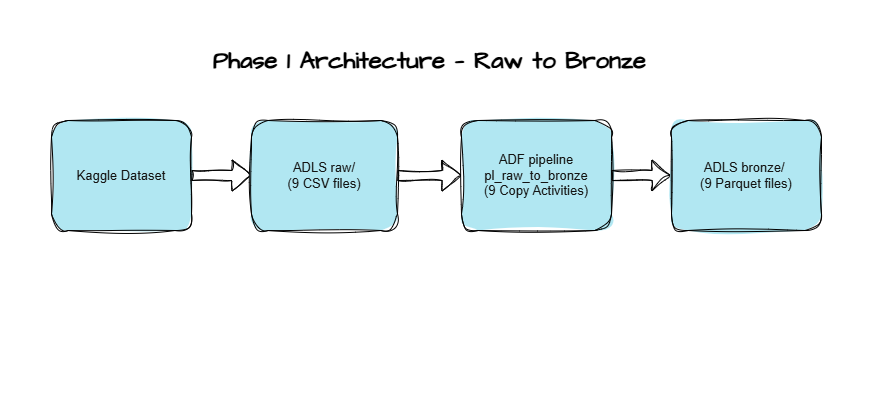

## E-Commerce Order Intelligence Platform
Azure Data pipeline using ADF, Databricks, Delta Lake & Microsoft Fabric.
**Stack:** ADF · ADLS Gen2 · Databricks · PySpark · Delta Lake · Power BI
**Dataset:** Brazilian E-Commerce (Olist) — 100k+ real orders

## Architecture

## Dataset
Brazilian E-Commerce Public Dataset by Olist. 9 tables, ~100k orders, 2016–2018. Source: Kaggle

## How to Run
### Prerequisites
- Azure subscription (free tier works)
- Azure Data Factory instance
- Azure Data Lake Storage Gen2 account with containers: 'raw', 'bronze', 'silver', 'gold'
- [Brazilian E-Commerce dataset](https://www.kaggle.com/datasets/olistbr/brazilian-ecommerce) downloaded from Kaggle

### Step 1 — Create Azure resource
In Azure Portal, create a resource group. Inside it, create ADLS Gen2 storage account with hierarchical namespace ON.

### Step 2 — Upload raw data
Upload all 9 CSV files from the Kaggle dataset into:

ADLS: raw/olist/

### Step 3 — Configure ADF Linked Service
In ADF Studio -> Manage -> Linked Services -> create a linked service
to your ADLS Gen2 account named 'ls_adls_ecommerce'.

### Step 4 — Run the ingestion pipeline
In ADF Studio -> Author -> Pipelines -> 'pl_raw_to_bronze' -> create 9 Copy Activity to convert CSV to Parquet -> click **Trigger Now**.

This runs 9 parallel Copy Activities that convert all CSV files to Parquet format with Snappy compression and land them in:

ADLS: bronze/olist/<table_name>/

### Known Data Quality Issues
Filename: 'olist_order_reviews_dataset.csv'
Issue: Contains embedded newlines ('\n') inside 'review_comment_message' field (3,852 affected rows).  
Resolution: Handled via ADF fault tolerance — incompatible rows are skipped and logged to 'raw/olist/logs/'. Full data recovered in Silver layer using PySpark 'multiLine=True'.

## Notebooks
| Notebook | Layer | Description |
|---|---|---|
| 00_mount_adls | Setup | Mounts ADLS Gen2 containers to Databricks |
| 01_bronze_to_delta | Bronze | Converts Parquet files to Delta format |
| 02_silver_cleaning | Silver | Cleans nulls, fixes types, deduplicates, recovers order_reviews |
| 03_gold_aggregations | Gold | Builds revenue_by_category and orders_by_state tables |

## Key Findings
- Total platform revenue: $13.5M across 2016-2018
- Top state by orders: SP (Sao Paulo) with ~41% of all orders
- Top category: health_beauty
- order_reviews: PySpark recovered 99,224 rows vs ADF's partial read
